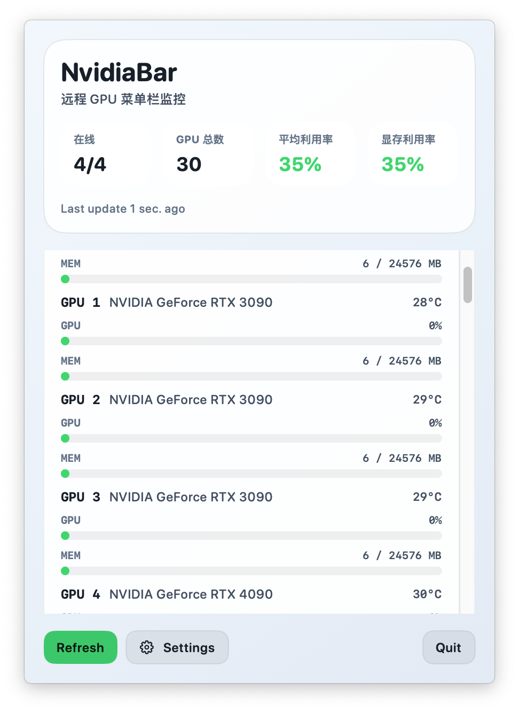

# NvidiaBar

NvidiaBar is a macOS menu bar app for monitoring NVIDIA GPU usage across remote SSH servers.



## Open-source release model

- Release builds are published to GitHub Releases as a downloadable `.zip`.
- The public repository does not ship with personal server addresses, SSH keys, passwords, or local planning documents.
- Server configuration is local-only and stored in `UserDefaults` on each machine.
- A public template is provided at [`config/server-config.template.json`](config/server-config.template.json).

## Local development

Build a local `.app` bundle:

```bash
zsh scripts/build_app.sh
```

Install into `/Applications`:

```bash
zsh scripts/install_app.sh
```

Create a release archive:

```bash
zsh scripts/package_release.sh 0.1.0
```

## GitHub release flow

1. Push the public branch to GitHub `main`.
2. Move the release tag such as `v0.1.0` to the intended public commit.
3. Build `NvidiaBar-0.1.0.zip` from the public branch and upload it to the matching GitHub Release.

## Public publishing hygiene

- Use a neutral public bundle identifier for release builds.
- Keep all example values in public configs and screenshots free of personal information.
- Do not publish `AGENTS.md`, `progress/`, private exports, or local cache files.

## Personal environment hygiene

- Keep real SSH aliases and private configs outside the public repository.
- Do not commit private config exports.
- If you need a private reference file, copy `config/server-config.template.json` to a path outside this repository and fill in your own values there.
- The app uses the system `ssh` command and never stores passwords in the repository.
