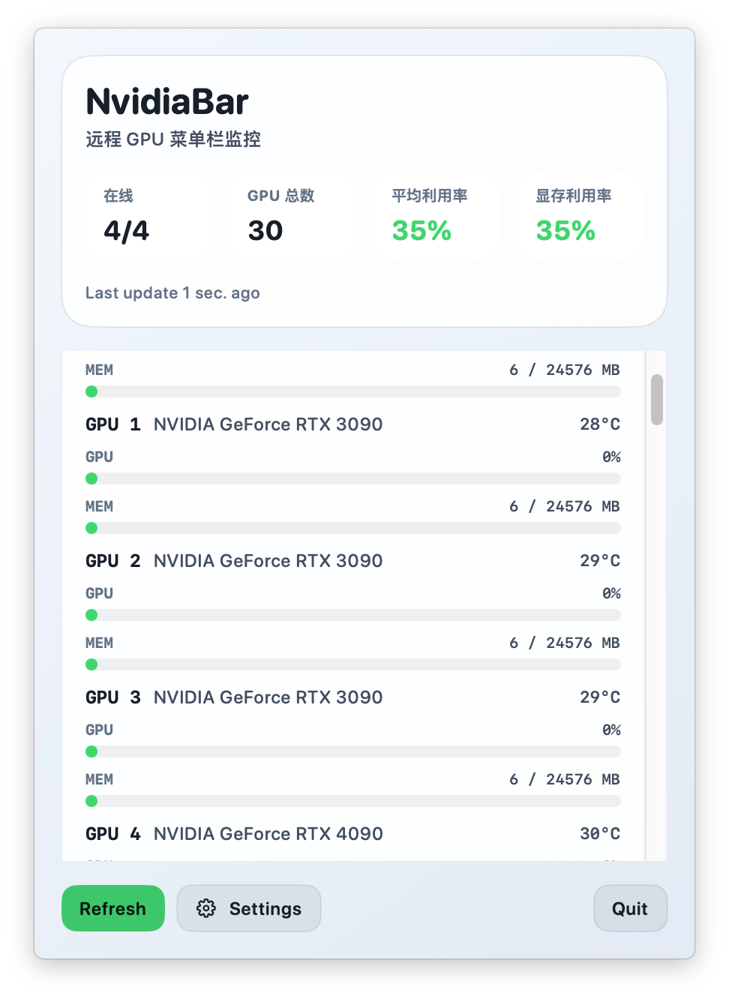

# NvidiaBar

NvidiaBar is a macOS menu bar app for monitoring NVIDIA GPU usage across remote SSH servers.



## Open-source release model

- Server configuration is local-only and stored in `UserDefaults` on each machine.
- A public template is provided at [`config/server-config.template.json`](config/server-config.template.json).

## Local development

Build a local `.app` bundle:

```bash
zsh scripts/build_app.sh
```

Install into `/Applications`:

```bash
zsh scripts/install_app.sh
```

Create a release archive:

```bash
zsh scripts/package_release.sh 0.1.0
```
